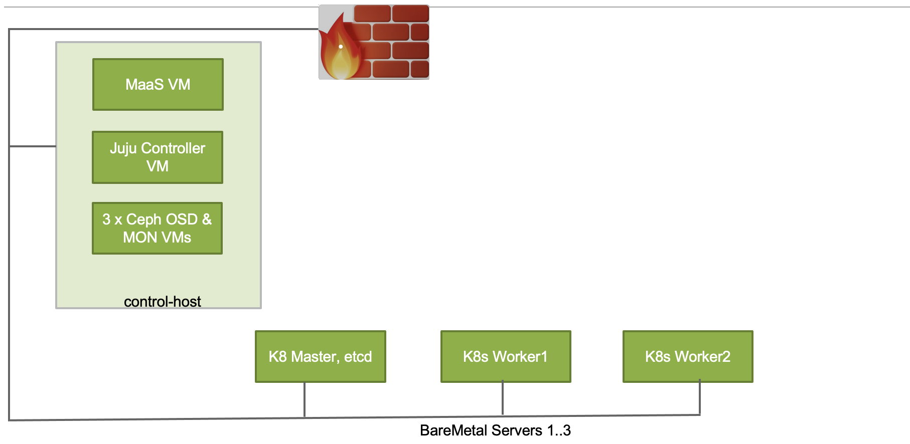

# charmed-kubernetes-on-bare-metals
## Problem Statement 
* NFVI/ teclo cloud solutions have been traditionally designed with virtual machine-based solutions and virtual machine-based network functions (NF) are called VNFs (e.g. vEPC , vIMS, vBNG). 
* This approach worked well for quite some time until NF vendors started adapting containerized technologies and container-based network fucntions are called CNF.
Many telecom providers have adapted the containerized network functions model and used their IaaS projects (e.g., Opnestack or VMWare-based ) for CNF nested deployment over VMs.
* Main projects for handling the infrastructure requirements of CNFs are ( Kubernetees, also known as K8s and Redhat Openshift which is again based on k8s).
* But deploying nested containers inside VMs brought some challenges related to performance and  extension of multiple interfaces to the  containerized network functions (e.g., adding 1 interface for control plane functionality and 1 or more interfaces for data-plane functionality).
## Solution
* To resolve challenges that are centered around performance, K8s or Openshift have to be installed on baremetal servers.
* To resolve network challenges, Multus (aka Meta CNI) should be used, which can work with any CNI (e.g., Flanel or Calico to provide control plane interface) and use SRIOV virtual functions for data plane interface. 
* In this wiki I will cover barematal K8s deployment by using Canonical MaaS (Metal as a Service) and Juju.
* The use of Multus CNI in conjunction with Flannel and SRIOV VFs will be discussed in another wiki.

## Logical Design


## Physical Design


## Deployment Sequence
* It is expected that the control-host is up and running, has internet access and is ready to host KVM VMs.
### Creating MaaS VM
* I have downloaded ubuntu-20.04-server-cloudimg-amd64-disk-kvm.img image from [cloud-images](http://cloud-images-archive.ubuntu.com/releases/focal/release-20210921/)
* You may use the same or select any other cloud image from the Ubuntu Focal release.

```
devops@control-host:~/maas$ pwd
/home/devops/maas
wget http://cloud-images-archive.ubuntu.com/releases/focal/release-20210921/ubuntu-20.04-server-cloudimg-amd64-disk-kvm.img 
```
##### Preparing Cloud-Init Config

```
cat << EOF > cloud_init.cfg
#cloud-config
package_upgrade: true
hostname: maas
fqdn: mass.knawaz.lab.jnpr
manage_etc_hosts: true
users:
  - name: ubuntu
    lock_passwd: false
    shell: /bin/bash
    ssh_pwauth: true
    home: /home/ubuntu
    sudo: ['ALL=(ALL) NOPASSWD:ALL']
    ssh-authorized-keys:
      - ssh-rsa "SSH-KEY"
  - name: devops
    lock_passwd: false
    shell: /bin/bash
    home: /home/devops
    ssh_pwauth: true
    sudo: ['ALL=(ALL) NOPASSWD:ALL']
    ssh-authorized-keys:
      - ssh-rsa "SSH-KEY"
chpasswd:
  list: |
     ubuntu:<YOUR PASSWORD>
  expire: False
chpasswd:
  list: |
     devops:<YOUR PASSWORD>
  expire: False

write_files:
  - path:  /etc/netplan/50-cloud-init.yaml
    permissions: '0644'
    content: |
         network:
           version: 2
           renderer: networkd
           ethernets:
             ens3:
               addresses: [192.168.24.20/24]
             ens4:
               addresses: [192.168.8.20/24]
               gateway4: 192.168.8.1
               nameservers:
                 addresses: [8.8.8.8]

runcmd:
 - [sudo, ifconfig, IFNAME, up]
 - [sudo, ifconfig, IFNAME, up]
 - [sudo, netplan, generate]
 - [sudo, netplan, apply]
 - [sudo, sed ,-i, 's/PasswordAuthentication no/PasswordAuthentication yes/g', /etc/ssh/sshd_config]
 - [sudo, systemctl, restart, sshd]
EOF 
cloud-localds -v  /home/devops/maas/cloud_init.img /home/devops/maas/cloud_init.cfg
```

#### Initiating MaaS VM Creation

```
qemu-img create -b /home/devops/maas/ubuntu-20.04-server-cloudimg-amd64-disk-kvm.img  -f qcow2 -F qcow2 /var/lib/libvirt/images/maas.qcow2 200G
virt-install --name maas \
  --virt-type kvm --memory 4096  --vcpus 4 \
  --boot hd,menu=on \
  --disk path=/home/contrail/maas/cloud_init.img,device=cdrom \
  --disk path=/var/lib/libvirt/images/maas.qcow2,device=disk \
  --graphics vnc \
  --os-type=Linux \
  --os-variant=ubuntu20.04 \
  --network bridge:br-ctrplane \
  --network bridge:br-external \
  --console pty,target_type=serial
```
* If in case you get an error that Ubuntu 20.04 varients is not found then use the following sequence.
[20.04-varient-error](https://askubuntu.com/questions/1103662/distro-ubuntu18-04-does-not-exist-in-our-dictionary)
```
apt install osinfo-db-tools -y
wget https://releases.pagure.org/libosinfo/osinfo-db-20211013.tar.xz
osinfo-db-import -v osinfo-db-20211013.tar.xz
ls /etc/osinfo/
------------------------------------------------
```
* Keep an eye on Maas VMs' console from a separate terminal, and once console logs show that user config has been pushed via cloud-init, try to login into the MaaS VM and check if everything is configured as expected (e.g. hostname, IP connectivity, Internet access, etc).

### Installing MaaS
* Acknowledgment; I got some help on the latest MaaS version installation and adding it to Juju from [core-k8s-deployment](https://github.com/antongisli/maas-baremetal-k8s-tutorial/blob/main/maas-setup.sh).
```
sudo snap switch --channel=latest/stable lxd
sudo snap install lxd
sudo snap refresh lxd
sudo snap install jq
sudo snap install --channel=3.1/edge maas
sudo snap install --channel=3.1/edge maas-test-db

export INTERFACE=$(ip route | grep default | cut -d ' ' -f 5)
export IP_ADDRESS=$(ip -4 addr show dev $INTERFACE | grep -oP '(?<=inet\s)\d+(\.\d+){3}')
sudo maas init region+rack --database-uri maas-test-db:/// --maas-url http://${IP_ADDRESS}:5240/MAAS
MAAS has been set up.

If you want to configure external authentication or use
MAAS with Canonical RBAC, please run

  sudo maas configauth

To create admins when not using external authentication, run
  sudo maas createadmin 

sudo maas createadmin --username admin --password admin --email admin
export APIKEY=$(sudo maas apikey --username admin)
# MAAS admin login
maas login admin 'http://localhost:5240/MAAS/' $APIKEY
echo $IP_ADDRESS
```
### Finishing the MaaS Setup Process
* In order to finish, you need to login to the MaaS GUI at http://$MASS_VM_IP_ADDRESS:5240/MAAS/ and go through some steps to finish the MaaS setup process (unfortunately, I did capture those screens, so I am not adding those screens. 

### Network Setup in MaaS
* I am only using a single network deployment in my lab (change the following values as per your setup).
```
export SUBNET=192.168.24.0/24
export FABRIC_ID=$(maas admin subnet read "$SUBNET" | jq -r ".vlan.fabric_id")
export VLAN_TAG=$(maas admin subnet read "$SUBNET" | jq -r ".vlan.vid")
export PRIMARY_RACK=$(maas admin rack-controllers read | jq -r ".[] | .system_id")
maas admin subnet update $SUBNET gateway_ip=192.168.24.1
maas admin ipranges create type=reserved start_ip=192.168.24.1 end_ip=192.168.24.30
maas admin ipranges create type=dynamic start_ip=192.168.24.100 end_ip=192.168.24.250
maas admin vlan update $FABRIC_ID $VLAN_TAG dhcp_on=True primary_rack=$PRIMARY_RACK
maas admin maas set-config name=upstream_dns value=8.8.8.8
maas admin spaces create name=oam-space
maas admin vlan update  $FABRIC_ID $VLAN_TAG space=oam-space
```

### Juju-Controller Setup 
#### Creating Juju-Controller VM
* IOn my control-host, I created a Juju-Controller VM (KVM host also hots my maas VM, see Physical Design Section above).

```
for i in   juju-controller 
do
qemu-img create -f qcow2 /home/${i}.qcow2 100G
virt-install --ram 8192 --vcpus 8 --os-variant ubuntu20.04  --disk path=/home/${i}.qcow2,device=disk,bus=virtio,format=qcow2 --graphics vnc,listen=0.0.0.0 --network bridge=br-ctrplane  --boot=network,hd --name ${i} --cpu Nehalem,+vmx --dry-run --print-xml > /tmp/${i}.xml; virsh define --file /tmp/${i}.xml
done
vrish domiflist juju-controller  
```
#### Registering the Juju-Controller VM into MaaS
```
maas admin machines create \
hostname=juju-controller \
tag_names=juju-controller \
architecture=amd64 \
mac_addresses=<mac address of juju-controller-vm, see last instruction in Creating Juju-Controller VM section > \
power_type=virsh \
power_parameters_power_id=juju-controller \
power_parameters_power_address=qemu+ssh://devops@<IP address of my control-host>/system \
power_parameters_power_pass=<password>
JUJU_TAG=$(maas admin machines read | jq  '.[]| select(."hostname"=="juju-controller") | .["tag_names"]' | tr -d '"')
JUJU_SYSID=$(maas admin machines read | jq  '.[]| select(."hostname"=="juju-controller") | .["system_id"]' | tr -d '"')
maas admin tag update-nodes "juju-controller" add=$JUJU_SYSID
```
#### Adding MaaS Cloud to Juju 
```
sudo snap install juju --classic
cat << EOF > maas-cloud.yaml 
clouds:       
  maas-cloud:
    type: maas
    auth-types: [oauth1]
    endpoint: http://IP_ADDRESS:5240/MAAS
EOF
export INTERFACE=$(ip route | grep default | cut -d ' ' -f 5)
export IP_ADDRESS=$(ip -4 addr show dev $INTERFACE | grep -oP '(?<=inet\s)\d+(\.\d+){3}')
sed -i "s/IP_ADDRESS/$IP_ADDRESS/" maas-cloud.yaml
cat maas-cloud.yaml 
clouds:
  maas-cloud:
    type: maas
    auth-types: [oauth1]
    endpoint: http://192.168.8.20:5240/MAAS

juju add-cloud --local maas-cloud maas-cloud.yaml

Cloud "maas-cloud" successfully added to your local client.
You will need to add a credential for this cloud (`juju add-credential maas-cloud`)
before you can use it to bootstrap a controller (`juju bootstrap maas-cloud`) or
to create a model (`juju add-model <your model name> maas-cloud`).

APIKEY=$(sudo maas apikey --username admin)
echo $APIKEY 
#carefully copy the the output , don't add any space or any other character in it.
#paste this API key once reach "Enter maas-oauth" step 

juju add-credential maas-cloud
This operation can be applied to both a copy on this client and to the one on a controller.
No current controller was detected and there are no registered controllers on this client: either bootstrap one or register one.
Enter credential name: admin

Regions
  default

Select region [any region, credential is not region specific]:

Using auth-type "oauth1".

Enter maas-oauth:

Credential "admin" added locally for cloud "maas-cloud"

juju clouds --local

# Bootstrap the maas-cloud - get a coffee
juju credentials
#following step will take some time, so be patient. 
juju bootstrap maas-cloud --bootstrap-constraints "tags=juju-controller" --debug 
Bootstrap complete, controller "maas-cloud-default" is now available
Controller machines are in the "controller" model
05:15:31 INFO  cmd bootstrap.go:595 Initial model "default" added
05:15:31 INFO  cmd supercommand.go:544 command finished

juju gui
```
* Login to Juju GUI by using the output obtained from the above command.

### Adding Baremetal Servers Into MaaS
* I am using Dell R720 machines and an IDRAC user name and password are required for this sequence.
* The 192.168.100.0/24 subnet belongs to the IPMI Network in my lab. Change it as per your setup.
* I have also enabled pxe boot on one of the onboard NICs, and the MAC address for that NIC will be used in the following commands.
* The PXE boot nic must not be vlan tagged on the network.
```

maas admin machines create \
    hostname=worker1 \
    fqdn=worker1.maas \
    mac_addresses=<PXE boot mac> \
    architecture=amd64 \
    power_type=ipmi \
    power_parameters_power_driver=LAN_2_0 \
    power_parameters_power_user=root \
    power_parameters_power_pass=<password> \
    power_parameters_power_address=<IPMI IP>


maas admin tags create name=worker1 comment='for worker1 node'
WORKER1_SYSID=$(maas admin machines read | jq '.[] | select(."hostname"=="worker1")| .["system_id"]' | tr -d '"')
maas admin tag update-nodes "worker1" add=$WORKER1_SYSID

maas admin machines create \
    hostname=worker2 \
    fqdn=worker2.maas \
    mac_addresses=<PXE boot mac> \
    architecture=amd64 \
    power_type=ipmi \
    power_parameters_power_driver=LAN_2_0 \
    power_parameters_power_user=root \
    power_parameters_power_pass=<password> \
    power_parameters_power_address=<IPMI IP>

maas admin tags create name=worker2 comment='for worker2 node'
WORKER2_SYSID=$(maas admin machines read | jq '.[] | select(."hostname"=="worker2")| .["system_id"]' | tr -d '"')
maas admin tag update-nodes "worker2" add=$WORKER2_SYSID


maas admin machines create \
    hostname=master \
    fqdn=master.maas \
    mac_addresses=<PXE boot mac> \
    architecture=amd64 \
    power_type=ipmi \
    power_parameters_power_driver=LAN_2_0 \
    power_parameters_power_user=root \
    power_parameters_power_pass=<password> \
    power_parameters_power_address=<IPMI IP>

maas admin tags create name=master comment='for master node'
MASTER_SYSID=$(maas admin machines read | jq '.[] | select(."hostname"=="master")| .["system_id"]' | tr -d '"')
maas admin tag update-nodes "master" add=$MASTER_SYSID
```
### Creating Ceph OSD Machines
* Due to scaricty of resources I am using VMs to host Ceph OSDs.
* Ceph VMs are created on my control-host (see Physical Design Section).

```
on control-host 
for i in   ceph_node_1_disk_1 ceph_node_2_disk_1 ceph_node_3_disk_1
do
qemu-img create -f qcow2 /var/lib/libvirt/images/${i}.qcow2 100G
done

for i in   ceph_node_1_disk_2 ceph_node_2_disk_2 ceph_node_3_disk_2 
do
qemu-img create -f qcow2 /var/lib/libvirt/images/${i}.qcow2 300G
done

for i in   ceph_node_1 ceph_node_2 ceph_node_3 
do
virt-install --ram 8192 --vcpus 8 --os-variant ubuntu20.04  --disk path=/var/lib/libvirt/images/${i}_disk_1.qcow2,device=disk,bus=virtio,format=qcow2  --disk path=/var/lib/libvirt/images/${i}_disk_2.qcow2,device=disk,bus=virtio,format=qcow2 --graphics vnc,listen=0.0.0.0 --network bridge=br-ctrplane  --boot=network,hd --name ${i} --cpu Nehalem,+vmx --dry-run --print-xml > /tmp/${i}.xml; virsh define --file /tmp/${i}.xml
done 

for i in   ceph_node_1 ceph_node_2 ceph_node_3 
do
virsh domiflist $i
done 
```
### Registering Ceph OSD VMs in MaaS
* Note down the MAC address of each Ceph VM from the output of the last sequence executed in the section above.
```
maas admin machines create \
hostname=ceph-node-1 \
architecture=amd64 \
mac_addresses=<mac address> \
power_type=virsh \
power_parameters_power_id=ceph_node_1 \
power_parameters_power_address=qemu+ssh://devops@<control-host IP>/system \
power_parameters_power_pass=<password>

maas admin tags create name=ceph-node-1 comment='ceph-node-1'
SYSID=$(maas admin machines read | jq '.[] | select(."hostname"=="ceph-node-1")| .["system_id"]' | tr -d '"')
maas admin tag update-nodes "ceph-node-1" add=$SYSID

maas admin machines create \
hostname=ceph-node-2 \
architecture=amd64 \
mac_addresses=<mac address> \
power_type=virsh \
power_parameters_power_id=ceph_node_2 \
power_parameters_power_address=qemu+ssh://devops@<control-host IP>/system \
power_parameters_power_pass=<password> 

maas admin tags create name=ceph-node-2 comment='ceph-node-2'
SYSID=$(maas admin machines read | jq '.[] | select(."hostname"=="ceph-node-2")| .["system_id"]' | tr -d '"')
maas admin tag update-nodes "ceph-node-2" add=$SYSID

maas admin machines create \
hostname=ceph-node-3 \
architecture=amd64 \
mac_addresses=<mac address> \
power_type=virsh \
power_parameters_power_id=ceph_node_3 \
power_parameters_power_address=qemu+ssh://devops@<control-host IP>/system \
power_parameters_power_pass=<password>

maas admin tags create name=ceph-node-3 comment='ceph-node-3'
SYSID=$(maas admin machines read | jq '.[] | select(."hostname"=="ceph-node-3")| .["system_id"]' | tr -d '"')
maas admin tag update-nodes "ceph-node-3" add=$SYSID
```

### Deployment of Charmed K8s
* The last step is to deploy Charmed K8s.
* I have created a k8s_no_api_lbr.yml bundle file for my deployment.
* Take note of the tags and machine numbering in the k8s_no_api_lbr.yml bundle files, as well as how they are referred to in application deployments.
```
juju deploy ./k8s_no_api_lbr.yml
```
* Wait until you get the message "Deploy of bundle completed."
* To monitor the deployment status, "watch -c juju status --color" 
* Once all of the applications have been deployed, log in to the K8s controller and check the cluster status.
```
juju ssh 3 kubectl cluster-info 
juju ssh 3 kubectl get nodes 
juju ssh 3 kubectl get pods -n kube-system
juju ssh 3 kubectl get pods --all-namespaces 
```
* I have also created a k8s_api_lbr.yml bundle file which deploys kubeapi-loadbalancer as well, but I was getting the following error.
```
 2022-02-20 00:30:35 WARNING unit.kubernetes-master/0.certificates-relation-changed logger.go:60 ERROR cannot open 6443/tcp (unit "kubernetes-master/0"): port range conflicts with 6443/tcp (unit "kubeapi-load-balancer/0")
 cannot open 6443/tcp (unit "kubeapi-load-balancer/1"): port range conflicts with 6443/tcp (unit "kubernetes-master/0")
```
* If anyone knows the solution to the above issue, then please contact me at "kashif-nawaz@outlook.com".
* If anyone wants to collaborate with me on this project or the next one, which is "Adding Multus Meta CNI with SRIOV on Baremetal Charmed K8s" then please contact me at my above given email address.
